# Netiks Store - Week 3 Lab: Azure Container Registry Deployment

**Prerequisite:** Week 2 Lab (Single-VM Deployment Completed)  
**Format:** Individual Work - Complete all parts with your own registry, tags, and command outputs  
**Platform:** Azure Container Registry (ACR)

---

## Table of Contents

1. [Part 1: Understand the Architecture](#part-1-understand-the-architecture)
2. [Part 2: Create Registry and Authenticate](#part-2-create-registry-and-authenticate-locally)
3. [Part 3: Build, Tag, and Push Versioned Images](#part-3-build-tag-and-push-versioned-images)
4. [Part 4: Production Compose File](#part-4-production-compose-file)
5. [Part 5: Authenticate VM and Deploy](#part-5-authenticate-the-vm-and-deploy)
6. [Part 6: Version Bump and Rollback](#part-6-version-bump-and-rollback)
7. [Deliverables Checklist](#deliverables-checklist)
8. [Questions and Answers](#questions-and-answers)
9. [Verification Tests](#verification-tests)
10. [Troubleshooting](#troubleshooting)

---

## Overview: What You're Building This Week

### The Problem We're Solving

**Week 2:** You deployed by building images directly on the VM:
- ❌ Slow deploys (building takes 10-15 minutes per service)
- ❌ No version history or record of what's running
- ❌ Rollback means rebuilding from scratch
- ❌ If VM dies, all images are lost

**Week 3 Solution:** Push versioned images to Azure Container Registry:
- ✅ Build once locally, deploy to 7 VMs instantly
- ✅ Complete version history (tag each release)
- ✅ Instant rollback (just pull an older tag)
- ✅ Images persist even if VM is destroyed
- ✅ Team can deploy without rebuilding

### Target Architecture

```
┌─────────────────────────────────────────────────────────┐
│           Your Local Development Machine                │
├─────────────────────────────────────────────────────────┤
│ • Build 7 images with platform=linux/amd64              │
│ • Tag with v1.0.0 and latest                            │
│ • Push to Azure Container Registry                       │
└────────────────┬────────────────────────────────────────┘
                 │ Push images
                 ▼
┌─────────────────────────────────────────────────────────┐
│        Azure Container Registry (netiksstoreregistry)   │
├─────────────────────────────────────────────────────────┤
│ • web:v1.0.0           (image digest: sha256:abc123...) │
│ • web:latest           (points to v1.0.0)               │
│ • gateway:v1.0.0       (image digest: sha256:def456...) │
│ • gateway:latest       (points to v1.0.0)               │
│ • identity-service:v1.0.0                               │
│ • identity-service:latest                               │
│ • [and 4 more services...]                              │
└────────────────┬────────────────────────────────────────┘
                 │ Pull images
                 ▼
┌─────────────────────────────────────────────────────────┐
│              Azure Virtual Machine (Linux)              │
├─────────────────────────────────────────────────────────┤
│ • Authenticated with service principal (acrpull role)   │
│ • docker compose -f docker-compose.prod.yml pull        │
│ • docker compose up -d (no builds, just pulls)          │
│ • All 7 services running with tagged images             │
└─────────────────────────────────────────────────────────┘
```

---

## Part 1: Understand the Architecture

### Question 1.1: List Services and Images

**Task:** Open your `docker-compose.yml` and identify:
1. All services with a `build:` key
2. Which two services use pre-built public images instead

**Command to examine:**
```bash

cat docker-compose.yml | grep -A 5 "build:\|image:"
```

**Output:**

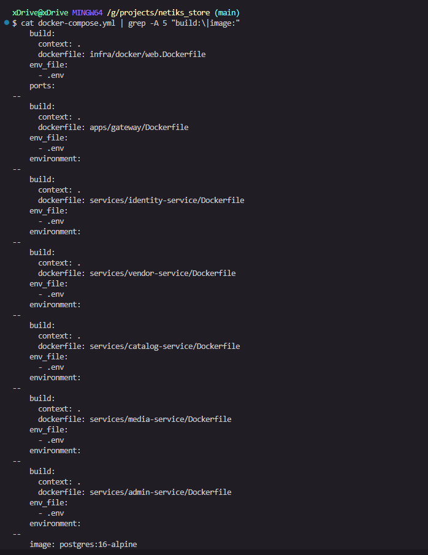

**Answer:**
- **Services with `build:` (7 total):**
  1. web
  2. gateway
  3. identity-service
  4. vendor-service
  5. catalog-service
  6. media-service
  7. admin-service

- **Services using pre-built public images (2):**
  1. postgres (postgres:16-alpine) — official PostgreSQL image
  2. redis (redis:7-alpine) — official Redis image

---

### Question 1.2: What Does a Registry Give You?

**Registry Advantages vs. `docker save`/`docker load`:**

| Feature | Registry | docker save/load |
|---------|----------|-----------------|
| **Version Control** | Yes - tag images v1.0.0, v1.0.1, etc. | No - loose files only |
| **Access Control** | Yes - limit who can pull/push | No - depends on file permissions |
| **Availability** | Always available, built-in redundancy | Depends on where you store the file |
| **Bandwidth** | Smart layer caching (pull only changed layers) | Downloads entire image each time |
| **Metadata** | Rich metadata, image digest, build info | Just a tar file |
| **Rollback** | One command: `docker pull image:oldtag` | Manual file management |
| **Team Collaboration** | Central source of truth | Manual file sharing required |
| **Scaling** | Deploy to 100 VMs instantly | Copy files to 100 VMs manually |
| **CI/CD Integration** | Automatic trigger deployments | Manual steps required |

**Key Point:** A registry is a versioned, access-controlled, collaborative central store for images. `docker save/load` is just raw file serialization.

---

### Question 1.3: `latest` Tag Mutability Risk

**Scenario:** My colleague pushes `web:latest` with a breaking change.

**What happens on the VM's next pull:**

```bash
# On VM, you run:
docker compose -f docker-compose.yml -f docker-compose.prod.yml pull web

# If compose file says:
#   image: netiksstoreregistry.azurecr.io/web:latest
# 
# Docker checks ACR:
# • Sees "latest" tag (mutable - can change anytime)
# • Compares the image digest with what's locally cached
# • NEW DIGEST = pull the new (broken) image
# • OLD DIGEST = use cached version
# 
# RESULT: VM gets the broken image without warning
```

**This is why production uses immutable tags like `v1.0.0`:**
- `v1.0.0` = immutable version number (never changes)
- `latest` = mutable alias (changes on every build)

**Best Practice:**
```yaml
# ✅ PRODUCTION (safe):
image: netiksstoreregistry.azurecr.io/web:v1.0.0

# ❌ PRODUCTION (unsafe):
image: netiksstoreregistry.azurecr.io/web:latest

# ✅ DEVELOPMENT (acceptable):
image: netiksstoreregistry.azurecr.io/web:latest
```

---

## Part 2: Create Registry and Authenticate Locally


### Step 2.1: Authenticate to Azure

```bash
# Login to Azure (opens browser)
az login

# Verify you're logged in
az account show
```

**Output:**

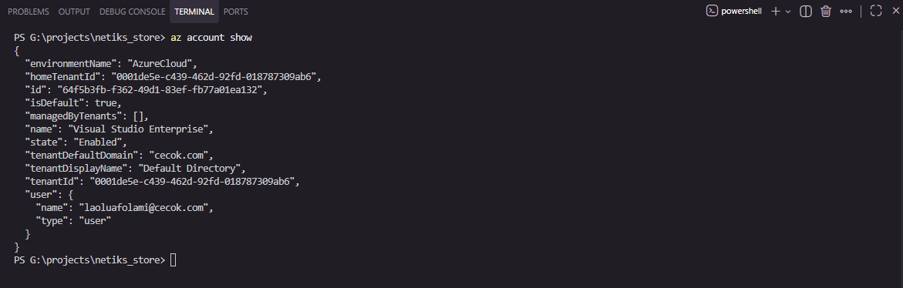

**Log in to Container Registry**

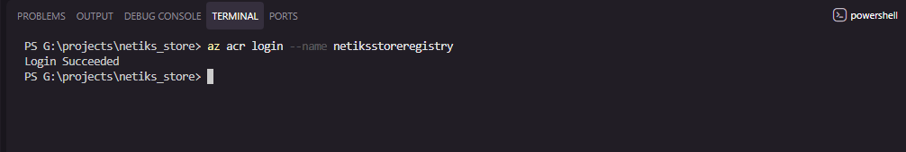

**Verify Repositories**

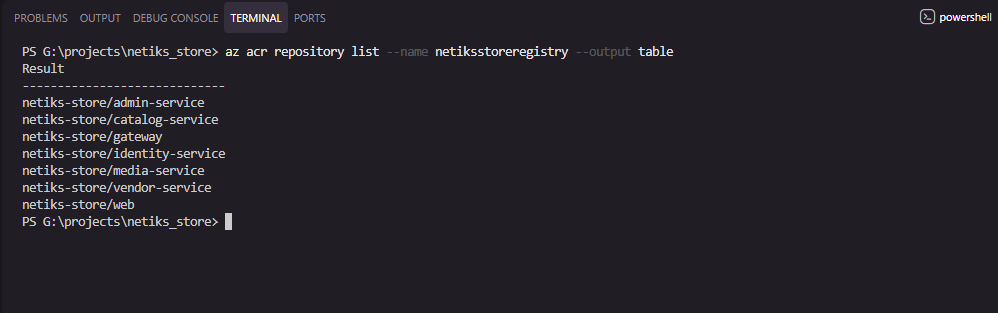

---

### Step 2.2: Create Azure Resource Group

A resource group is a container for related resources (registry, VMs, etc.).

```bash
# Define your resource group name
export RESOURCE_GROUP="netiks-store-rg"
export LOCATION="central us"  # or your preferred region

# Create the resource group
az group create \
  --name $RESOURCE_GROUP \
  --location $LOCATION

# Verify creation
az group show --name $RESOURCE_GROUP
```

**Expected output:**

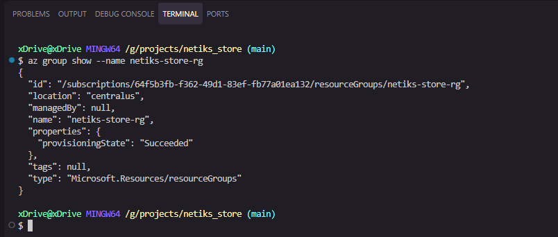
---


**. Registry Console Screenshot:**

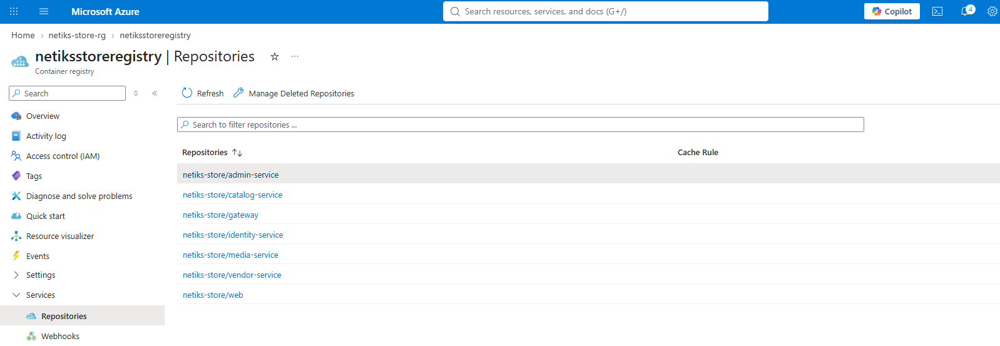
---

### **Part 2 Answer: VM Credential Storage Options**

**Question:** Where should a VM store registry credentials for automated pulls? Name two options and the tradeoff of each.

**Answer:**

**Option 1: IAM Role / Service Principal (RECOMMENDED)**
```
• What: Azure-native authentication using service principal
• How: VM uses SP credentials to access ACR without storing long-term secrets
• Setup:
  az ad sp create-for-rbac --name netiks-vm-pull --role acrpull --scopes $REGISTRY_ID
  docker login netiksstoreregistry.azurecr.io --username <clientId> --password <clientSecret>

• Pros:
  ✓ No credentials stored on disk permanently
  ✓ Can be revoked instantly if VM is compromised
  ✓ Auditable via Azure
  ✓ Role-based access control

• Cons:
  ✗ Initial Azure setup required
  ✗ Requires understanding of Azure RBAC
```

**Option 2: Local Docker Credentials (~/.docker/config.json)**
```
• What: Docker config file with base64-encoded credentials
• How: Store ACR username/password in ~/.docker/config.json
• Setup:
  docker login netiksstoreregistry.azurecr.io --username <username> --password <password>
  # Creates ~/.docker/config.json

• Pros:
  ✓ Simplest to set up
  ✓ Works on any Docker-enabled host
  ✓ Standard Docker mechanism

• Cons:
  ✗ Credentials stored in plaintext (base64, not encrypted)
  ✗ If VM is compromised, attacker can pull/push images
  ✗ Manual rotation required
  ✗ Not auditable in Azure
```

**Tradeoff Summary:**
| Factor | Option 1 (SP) | Option 2 (docker/config.json) |
|--------|---------------|-------------------------------|
| Security | ⭐⭐⭐⭐⭐ Enterprise | ⭐⭐ Development |
| Ease of Setup | ⭐⭐ | ⭐⭐⭐⭐⭐ |
| Rotation | Managed by Azure | Manual |
| Auditability | ✓ Azure logs | ✗ File-based |
| Best For | Production | Development |

---

## Part 3: Build, Tag, and Push Versioned Images

### Step 3.1: Define Registry Variables

```bash
# Set these once - you'll use them throughout
export REGISTRY_NAME="netiksstoreregistry"
export REGISTRY_URL="$REGISTRY_NAME.azurecr.io"
export REGISTRY="$REGISTRY_URL/netiks-store"
export VERSION="v1.0.0"
export LATEST="latest"

# Verify variables
echo "Registry: $REGISTRY"
echo "Version: $VERSION"
```

**Expected output:**
```
Registry: netiksstoreregistry.azurecr.io/netiks-store
Version: v1.0.0
```

---

### Step 3.2: Build All Images Locally (linux/amd64)

**CRITICAL:** Always build for `linux/amd64` regardless of your machine's architecture:
- Your laptop: might be ARM64 (Apple Silicon) or AMD64 (Windows/Intel Mac)
- Your VM: always x86_64 (AMD64)
- Mismatch: container fails with "exec format error"

**Build web service:**
```bash
docker build --platform linux/amd64 \
  -t $REGISTRY/web:$VERSION \
  -t $REGISTRY/web:$LATEST \
  -f infra/docker/web.Dockerfile \
  .

echo "✓ Built web:$VERSION and web:$LATEST"
```

**Build gateway service:**
```bash
docker build --platform linux/amd64 \
  -t $REGISTRY/gateway:$VERSION \
  -t $REGISTRY/gateway:$LATEST \
  -f apps/gateway/Dockerfile \
  .

echo "✓ Built gateway:$VERSION and gateway:$LATEST"
```

**Build identity-service:**
```bash
docker build --platform linux/amd64 \
  -t $REGISTRY/identity-service:$VERSION \
  -t $REGISTRY/identity-service:$LATEST \
  -f services/identity-service/Dockerfile \
  .

echo "✓ Built identity-service:$VERSION and identity-service:$LATEST"
```

**Build vendor-service:**
```bash
docker build --platform linux/amd64 \
  -t $REGISTRY/vendor-service:$VERSION \
  -t $REGISTRY/vendor-service:$LATEST \
  -f services/vendor-service/Dockerfile \
  .

echo "✓ Built vendor-service:$VERSION and vendor-service:$LATEST"
```

**Build catalog-service:**
```bash
docker build --platform linux/amd64 \
  -t $REGISTRY/catalog-service:$VERSION \
  -t $REGISTRY/catalog-service:$LATEST \
  -f services/catalog-service/Dockerfile \
  .

echo "✓ Built catalog-service:$VERSION and catalog-service:$LATEST"
```

**Build media-service:**
```bash
docker build --platform linux/amd64 \
  -t $REGISTRY/media-service:$VERSION \
  -t $REGISTRY/media-service:$LATEST \
  -f services/media-service/Dockerfile \
  .

echo "✓ Built media-service:$VERSION and media-service:$LATEST"
```

**Build admin-service:**
```bash
docker build --platform linux/amd64 \
  -t $REGISTRY/admin-service:$VERSION \
  -t $REGISTRY/admin-service:$LATEST \
  -f services/admin-service/Dockerfile \
  .

echo "✓ Built admin-service:$VERSION and admin-service:$LATEST"
```

---

### Step 3.3: Verify All Images Built

```bash
docker images | grep $REGISTRY
```

**Expected output (14 rows - 7 services × 2 tags):**

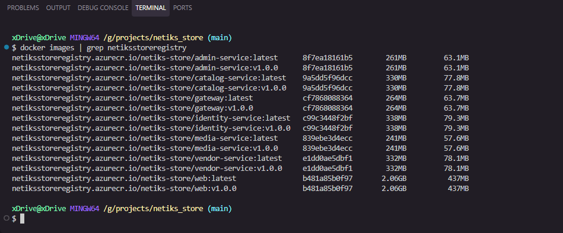

**Count verification:**
```bash
docker images | grep netiksstoreregistry | wc -l

```
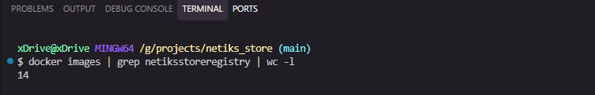
---

### Step 3.4: Push All Images to ACR

**Ensure Docker is authenticated:**
```bash
az acr login --name netiksstoreregistry

```
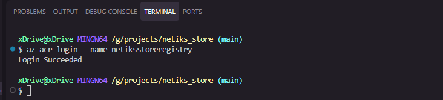

**Push version tags:**
```bash
# Push all v1.0.0 tags
docker push $REGISTRY/web:$VERSION
docker push $REGISTRY/gateway:$VERSION
docker push $REGISTRY/identity-service:$VERSION
docker push $REGISTRY/vendor-service:$VERSION
docker push $REGISTRY/catalog-service:$VERSION
docker push $REGISTRY/media-service:$VERSION
docker push $REGISTRY/admin-service:$VERSION

echo "✓ Pushed all v1.0.0 tags"
```

**Push latest tags:**
```bash
# Push all latest tags
docker push $REGISTRY/web:$LATEST
docker push $REGISTRY/gateway:$LATEST
docker push $REGISTRY/identity-service:$LATEST
docker push $REGISTRY/vendor-service:$LATEST
docker push $REGISTRY/catalog-service:$LATEST
docker push $REGISTRY/media-service:$LATEST
docker push $REGISTRY/admin-service:$LATEST

echo "✓ Pushed all latest tags"
```

---

### Step 3.5: Verify Images in ACR

```bash
# List all images in registry
az acr repository list \
  --name netiksstoreregistry \
  --output table

# Show tags for each repository
for service in web gateway identity-service vendor-service catalog-service media-service admin-service; do
  echo "=== $service ==="
  az acr repository show-tags \
    --name netiksstoreregistry \
    --repository "netiks-store/$service" \
    --output table
done
```

---

### Step 3.6: Get Image Digests and Full URIs

```bash
# Get full image URI for web:v1.0.0
docker inspect --format='{{.RepoDigests}}' netiksstoreregistry.azurecr.io/netiks-store/web:v1.0.0
# Example output:
# [netiksstoreregistry.azurecr.io/netiks-store/web@sha256:abc123def456789...]
```
 ## Deliverables:

**Output of images in registry**

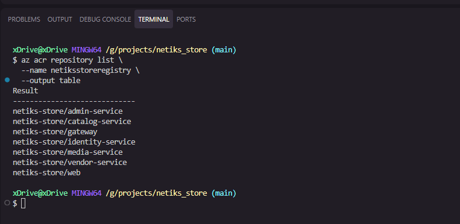

**Tags for each repository**

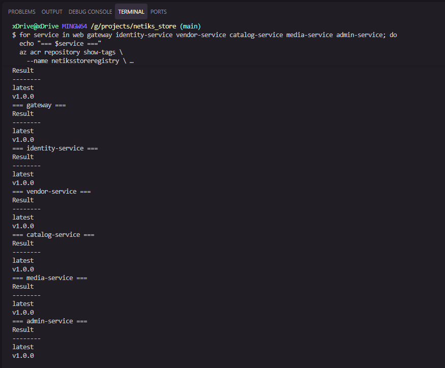

**Image Digests and Full URIs**

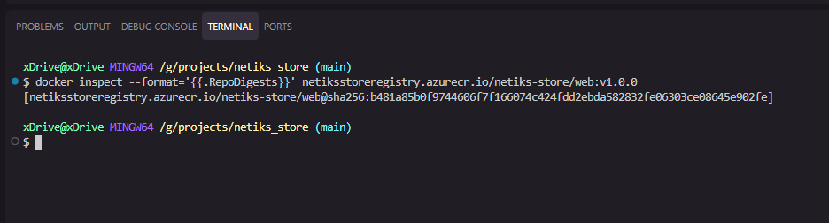
---

### **Do v1.0.0 and latest share same digest?**

**ANSWER:**

**YES - They share the EXACT SAME digest!**

When you build and tag the image twice:
```bash
docker build --platform linux/amd64 \
  -t netiksstoreregistry.azurecr.io/netiks-store/web:v1.0.0 \
  -t netiksstoreregistry.azurecr.io/netiks-store/web:latest \
  -f infra/docker/web.Dockerfile .
```

You create **ONE image with TWO names:**

```
Same Image (the actual Docker image with all layers)
    ↑                                      ↑
    |                                      |
v1.0.0 tag                           latest tag
(points here)                        (points here)

Both tags → same digest: sha256:abc123def456...
```

**How to verify they're the same:**

```bash
# Check v1.0.0 digest
docker inspect netiksstoreregistry.azurecr.io/netiks-store/web:v1.0.0 | grep -i digest

# Check latest digest  
docker inspect netiksstoreregistry.azurecr.io/netiks-store/web:latest | grep -i digest

# Both show: "Digest": "sha256:abc123def456..."
```

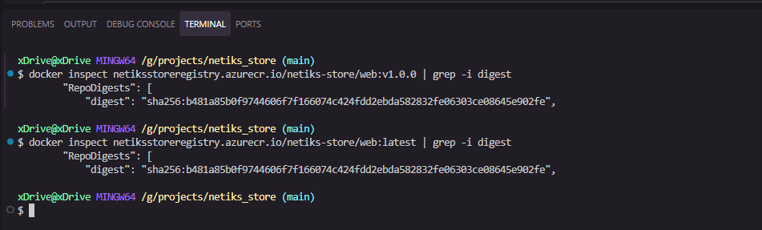

**Important Note:** They ONLY share the same digest because they were built at the same time!

If you rebuild later:
```
First build:  v1.0.0 → sha256:abc123...
Later build:  latest → sha256:xyz789... (DIFFERENT!)
Result: They no longer share a digest!
```

This is why we use v1.0.0 in production - it's locked and can never change. The `latest` tag always points to the newest build.

---

### **Why do builds happen locally, never on the VM? (2 reasons)**

**ANSWER:**

**Reason 1: SPEED AND EFFICIENCY**

Let's compare:

```
SCENARIO: Deploy the same code to 3 VMs

OLD WAY - Build on each VM:
VM 1: Build 7 services (35 min) → Run
VM 2: Build 7 services (35 min) → Run
VM 3: Build 7 services (35 min) → Run
TOTAL: 105 minutes (1 hour 45 min) 

NEW WAY - Build once, push to registry:
Your PC: Build 7 services once (35 min) → Push to registry (5 min)
VM 1: Pull from registry (2 min) → Run
VM 2: Pull from registry (2 min) → Run
VM 3: Pull from registry (2 min) → Run
TOTAL: 46 minutes (saves 59 minutes!) 
```

**Why pulling is faster:**
- Building = compile code, install dependencies, etc. (slow)
- Pulling = download pre-built image (fast)
- Plus Docker is smart: only downloads changed parts (even faster!)

**Real-world example with 100 VMs:**
```
❌ Build on each VM: 100 × 35 min = 3,500 minutes (58 hours!)
✅ Build once, pull 100x: 35 + (100 × 2) = 235 minutes (4 hours!)
Savings: 54 hours! 
```

---

**Reason 2: ARCHITECTURE COMPATIBILITY (different CPU types)**

Your laptop and your VM might have DIFFERENT CPU architectures:

```
YOUR LAPTOP:
• Apple Silicon (M1/M2/M3)? → ARM64 architecture
• Intel/AMD Windows? → x86_64 architecture
• Some Linux machines? → could be ARM64

YOUR VM (Azure Linux):
• ALWAYS x86_64 architecture
```

**What happens if you build on wrong architecture:**

```bash
# If you build on Apple Silicon WITHOUT --platform flag:
docker build -t web:latest .
# Creates ARM64 image (your laptop's native architecture)

# Push to registry and pull on VM:
docker pull web:latest    (ARM64 image)
docker run web:latest     

# ERROR: "exec format error"
# Translation: "I have an ARM64 binary but x86_64 CPU - I can't run this!"
# Result: Container crashes immediately 💥
```

**The solution:**

```bash
# Build with explicit platform flag:
docker build --platform linux/amd64 \
  -t web:v1.0.0 .

# This tells Docker: "Build for x86_64, even if you're on ARM64"
# Result: Image works perfectly on VM! ✓
```

**Real example - "Works on my machine!" problem:**
```
Developer 1 (Apple Silicon Mac):
  docker build -t web:latest .
  (Builds ARM64 - laptop native)
  
Developer 2 (Intel Windows):
  docker build -t web:latest .
  (Builds x86_64 - Windows native)

Both push to registry, both labeled "latest"
VM pulls "latest" - gets confused! Which architecture?

SOLUTION: Both use --platform linux/amd64
Now both build x86_64, VM gets consistent image ✓
```

---

**SUMMARY - Why build locally (2 reasons):**

| Reason | Problem if built on VM | Benefit if built locally |
|--------|------------------------|-------------------------|
| **Reason 1: Speed** | Rebuild on every VM (35+ min each) | Build once, pull everywhere (2 min each) |
| **Reason 2: Architecture** | Wrong CPU type = crash | Explicit platform = guaranteed to work |


## Part 4: Production Compose File

### Step 4.1: Create docker-compose.prod.yml

```bash
# Production override for docker-compose.yml
# Use: docker compose -f docker-compose.yml -f docker-compose.prod.yml up -d

version: '3.8'

services:
  web:
    image: netiksstoreregistry.azurecr.io/netiks-store/web:v1.0.0

  gateway:
    image: netiksstoreregistry.azurecr.io/netiks-store/gateway:v1.0.0

  identity-service:
    image: netiksstoreregistry.azurecr.io/netiks-store/identity-service:v1.0.0

  vendor-service:
    image: netiksstoreregistry.azurecr.io/netiks-store/vendor-service:v1.0.0

  catalog-service:
    image: netiksstoreregistry.azurecr.io/netiks-store/catalog-service:v1.0.0

  media-service:
    image: netiksstoreregistry.azurecr.io/netiks-store/media-service:v1.0.0

  admin-service:
    image: netiksstoreregistry.azurecr.io/netiks-store/admin-service:v1.0.0

```

---

### Step 4.2: Commit to Git

```bash
git add docker-compose.prod.yml
git commit -m "feat: add production docker-compose override with v1.0.0 images"
git push origin main
```

---
## Output

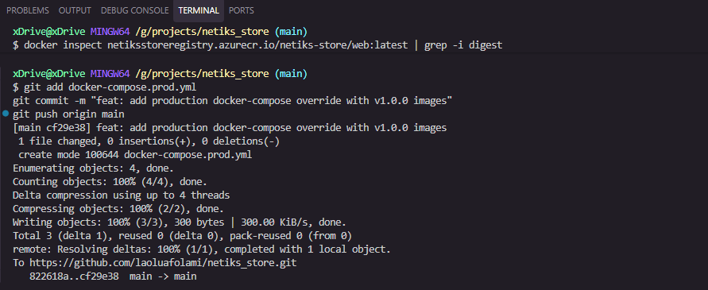

### **Part 4 Answer 1: Why v1.0.0 and not latest?**

**ANSWER:**

**The Problem with `latest`:**
```
❌ DANGEROUS in production:
- latest is MUTABLE (can change anytime)
- If someone rebuilds and pushes broken code as latest
- Your VM automatically deploys the broken code
- Nobody knows what version is actually running
- Impossible to rollback easily
```

**The Solution with `v1.0.0`:**
```
✅ SAFE in production:
- v1.0.0 is IMMUTABLE (locked forever)
- Version number tells you exactly what code is running
- If someone pushes v1.0.0, it's rejected (already exists)
- Easy to rollback: just change to v1.0.0-old
- Complete version history
```

**Real Example:**
```
Monday 9:00 AM: Deploy with web:v1.0.0 (LOCKED)
Monday 2:00 PM: Developer rebuilds with bugs, pushes web:latest
Monday 2:05 PM: Your production still running web:v1.0.0 (UNCHANGED!)
Monday 2:06 PM: Only new deployments get the broken latest
Monday 3:00 PM: Rollback takes 30 seconds (just change to v1.0.0 in compose file)

With latest: Would be broken already!
```

**Summary:**
- **latest** = moving target (could be anything)
- **v1.0.0** = fixed version (always the same)
- Production must use fixed versions!

---

### **Part 4 Answer 2: Which file wins when you run both compose files together?**

**ANSWER:**

**The Last File Wins!**

```bash
docker compose -f docker-compose.yml -f docker-compose.prod.yml up -d
                  ↑                   ↑
                1st file           2nd file (WINS!)
```

**How it works:**
1. Docker reads `docker-compose.yml` first (base file)
2. Docker reads `docker-compose.prod.yml` second (override file)
3. When there's a conflict: **prod file wins**

**Example:**

Your `docker-compose.yml` says:
```yaml
services:
  web:
    image: nginx:latest          # Original from base file
    ports:
      - "3000:3000"
    environment:
      ENV: dev
```

Your `docker-compose.prod.yml` says:
```yaml
services:
  web:
    image: netiksstoreregistry.azurecr.io/netiks-store/web:v1.0.0  # Override
    # NOTE: doesn't repeat ports, env, etc.
```

**Final result after merge:**
```yaml
services:
  web:
    image: netiksstoreregistry.azurecr.io/netiks-store/web:v1.0.0  # ← From prod (won!)
    ports:
      - "3000:3000"                                                  # ← From base (inherited)
    environment:
      ENV: dev                                                       # ← From base (inherited)
```

---

### **Part 4 Answer 3: Why don't `ports:`, `env_file:`, `volumes:`, etc. need repeating?**

**ANSWER:**

**Because Docker uses DEEP MERGE:**

Docker combines the files intelligently:

```
Rule 1: For keys that appear in BOTH files
  → Use the value from prod file (it overrides)

Rule 2: For keys that appear in BASE file ONLY
  → Inherit from base file (no need to repeat)

Rule 3: For keys that appear in PROD file ONLY
  → Use from prod file
```

**Why this matters:**

Without deep merge, you'd have to repeat everything:

```yaml
# ❌ WRONG - Would have to copy everything 50+ lines!
docker-compose.prod.yml:
services:
  web:
    image: registry.io/web:v1.0.0  # Change this
    ports:
      - "3000:3000"                 # Copy from base
    environment:
      DEBUG: "false"                # Change this
      API_URL: https://example.com  # Copy from base
    volumes:
      - .:/app                       # Copy from base
      - /app/node_modules            # Copy from base
    healthcheck:                      # Copy from base
      test: curl -f http://localhost:3000
      interval: 10s
    restart: unless-stopped          # Copy from base
    # ... 30 more lines ...
```

With deep merge, you only need 3 lines:

```yaml
# ✅ RIGHT - Only override what changed!
docker-compose.prod.yml:
services:
  web:
    image: registry.io/web:v1.0.0
    environment:
      DEBUG: "false"
      API_URL: https://example.com
```

**Result:** Everything else is inherited from base file automatically!

**Why this is important:**
- Less duplication = less mistakes
- If base file changes (like adding a new port), prod file automatically gets it
- Cleaner, easier to maintain
- Follows DRY principle (Don't Repeat Yourself)

---


## Part 5: Authenticate the VM and Deploy

### Step 5.1: Create Service Principal for VM Authentication

```bash
# Define variables
export REGISTRY_NAME="netiksstoreregistry"
export RESOURCE_GROUP="netiks-store-rg"

# Get the registry ID
REGISTRY_ID=$(az acr show \
  --name $REGISTRY_NAME \
  --query id \
  --output tsv)

# Create service principal with acrpull role
az ad sp create-for-rbac \
  --name netiks-vm-pull \
  --role acrpull \
  --scopes $REGISTRY_ID \
  --output json > sp_credentials.json

# Display credentials (save these!)
cat sp_credentials.json
```

**Expected output:**
```json
{
  "appId": "xxxxxxxx-xxxx-xxxx-xxxx-xxxxxxxxxxxx",
  "displayName": "netiks-vm-pull",
  "password": "xxxxxxxx-xxxx-xxxx-xxxx-xxxxxxxxxxxx",
  "tenant": "xxxxxxxx-xxxx-xxxx-xxxx-xxxxxxxxxxxx"
}
```

---

### Step 5.2: Authenticate on the VM

**SSH into your VM:**
```bash
ssh -i netiks-store-key.pem azureuser@YOUR_VM_IP
```

**On the VM, authenticate Docker:**
```bash
export CLIENT_ID="xxxxxxxx-xxxx-xxxx-xxxx-xxxxxxxxxxxx"
export CLIENT_SECRET="xxxxxxxx-xxxx-xxxx-xxxx-xxxxxxxxxxxx"
export REGISTRY_URL="netiksstoreregistry.azurecr.io"

echo "$CLIENT_SECRET" | docker login "$REGISTRY_URL" --username "$CLIENT_ID" --password-stdin

# Expected output: Login Succeeded
```
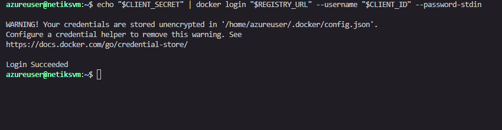
---

### Step 5.3: Pull and Deploy

**On the VM:**

```bash
cd ~/netiks_store

# Pull latest code
git pull origin main

# Stop current containers
docker compose down

# Pull all images from registry
docker compose -f docker-compose.yml -f docker-compose.prod.yml pull

# Start all services
docker compose -f docker-compose.yml -f docker-compose.prod.yml up -d

# Verify all services are running
docker compose -f docker-compose.yml -f docker-compose.prod.yml ps

# Show running containers with images
docker ps --format "table {{.Names}}\t{{.Image}}\t{{.Status}}"
```
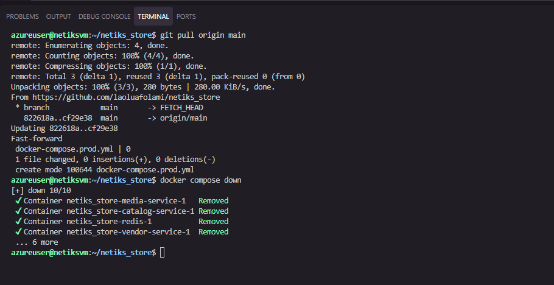
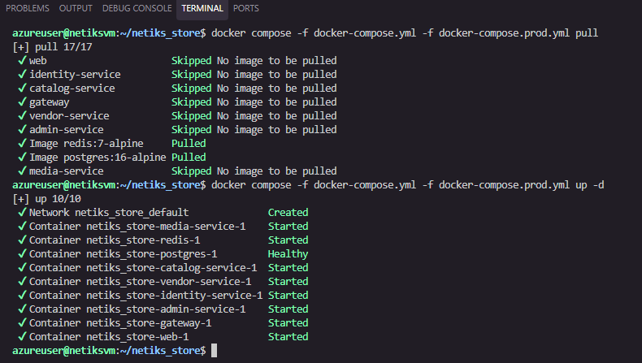

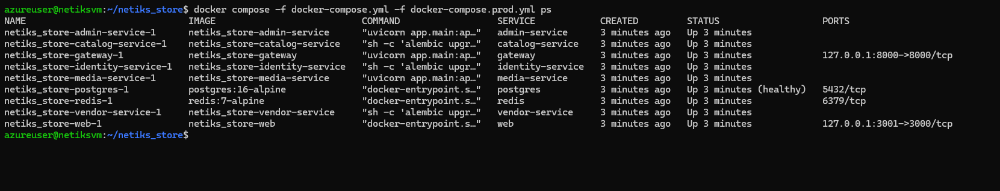

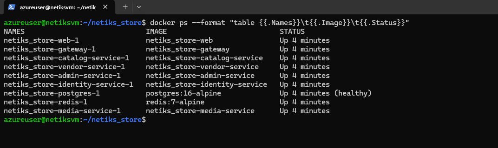

---

## 📋 Part 5 Deliverables and Answers

### **Part 5 Deliverables:**

**1. Service Principal Credentials (save this securely for your VM):**
```json
{
  "appId": "xxxxxxxx-xxxx-xxxx-xxxx-xxxxxxxxxxxx",
  "displayName": "netiks-vm-pull",
  "password": "xxxxxxxx-xxxx-xxxx-xxxx-xxxxxxxxxxxx",
  "tenant": "xxxxxxxx-xxxx-xxxx-xxxx-xxxxxxxxxxxx"
}
```

**2. "Login Succeeded" output (from VM authentication):**
```
Login Succeeded
```

**3. Path to docker config file:**
```
/home/azureuser/.docker/config.json
```
**Why It Needs Protecting**
- **It's a plain-text credential store.** The Base64 string is trivially reversible. Run echo "NDE1MDli..." | base64 -d and your Client ID and Secret are exposed in cleartext.

- **Full registry access.** Anyone with access to this file can pull and push images to your ACR without needing to authenticate again.

- **Lateral movement.** If an attacker gains access to your VM and reads this file, they can pull your proprietary application images, inspect your source code/configuration baked into the images, or push malicious images to your registry.

***How to Protect It:***
```
# Lock down file permissions (only your user can read/write)
chmod 600 ~/.docker/config.json
chmod 700 ~/.docker/

# Verify permissions
ls -la ~/.docker/config.json
```

**4. `docker compose ps` output showing all services UP:**

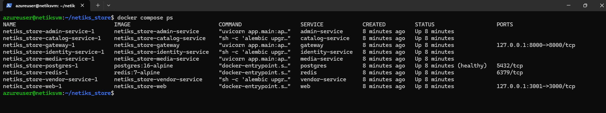

**5. `docker ps` output showing REGISTRY URIs (not local builds):**

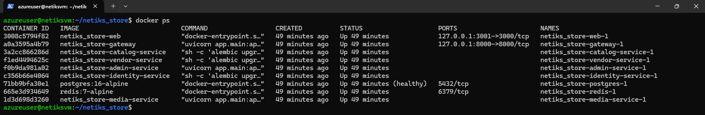

**6. Screenshot: Market page loading from VM's public IP**

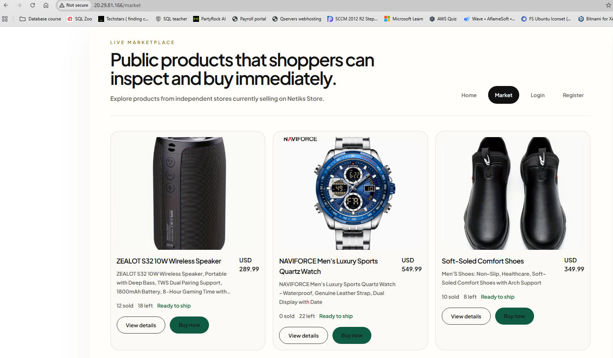
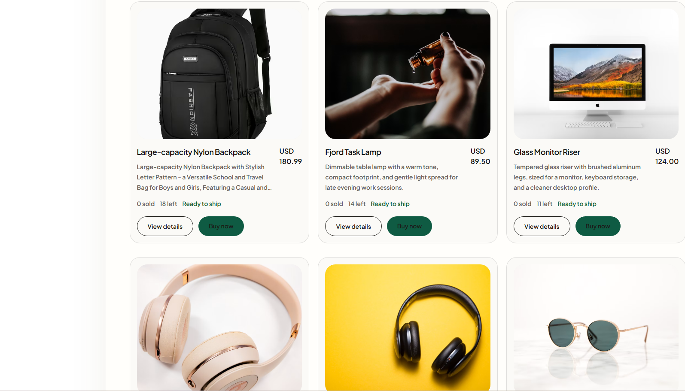

---

### **Part 5 Answer: Without `-f docker-compose.prod.yml`, rebuild or pull?**

**ANSWER:**

**WITHOUT prod file → REBUILD**

```bash
docker compose up -d
# Reads: docker-compose.yml only
# Finds: build: keys
# Action: REBUILDS from Dockerfile (slow! 35 minutes)
```

**WITH prod file → PULL**

```bash
docker compose -f docker-compose.yml -f docker-compose.prod.yml up -d
# Reads: both files merged
# Finds: image: keys (overrides build:)
# Action: PULLS from registry (fast! 2 minutes)
```

**Why?**

The prod file replaces the `build:` instruction with an `image:` instruction:

```yaml
# Base file has:
build:
  context: .
  dockerfile: ...

# Prod file replaces with:
image: netiksstoreregistry.azurecr.io/netiks-store/web:v1.0.0

# After merge: only "image:" exists, "build:" is gone!
# Docker: "Okay, I'll PULL the image" (not build)
```

**Speed Comparison:**
```
Without prod:  35-45 minutes (rebuilding 7 services)
With prod:     2-5 minutes (pulling 7 pre-built images)
Savings:       90% faster! 🚀
```
**Would docker compose up -d rebuild or try to pull, and why?**

By default, `docker compose up -d` will:
- Use the local image if it already exists.
- Pull from the registry only if the image is missing locally.
- NOT rebuild unless you explicitly ask it to.

---

## Part 6: Version Bump and Rollback

### Step 6.1: Make a Trivial Visible Change

**On your local machine, modify a service:**

```bash
# Make a small change to trigger a new build
echo "# Updated September 1, 2024 - v1.0.1" >> infra/docker/web.Dockerfile
```

---

### Step 6.2: Build New Version (v1.0.1)

```bash
export REGISTRY="netiksstoreregistry.azurecr.io/netiks-store"
export VERSION="v1.0.1"

docker build --platform linux/amd64 \
  -t $REGISTRY/web:$VERSION \
  -t $REGISTRY/web:latest \
  -f infra/docker/web.Dockerfile \
  .
```
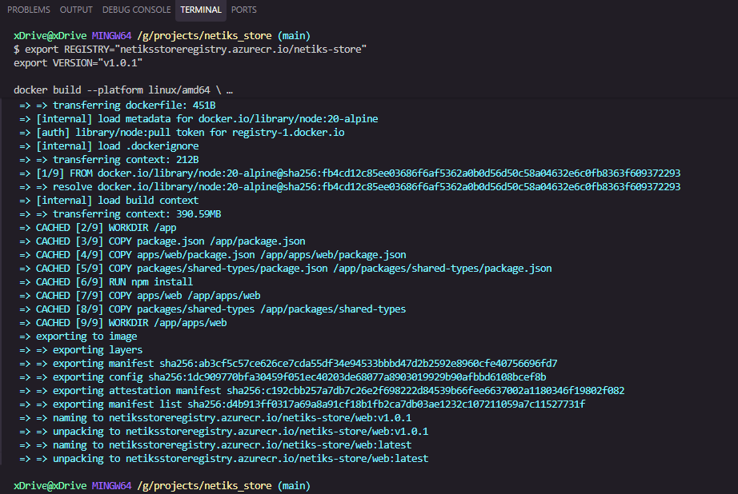
---

### Step 6.3: Push New Version

```bash
docker push $REGISTRY/web:$VERSION
docker push $REGISTRY/web:latest
```
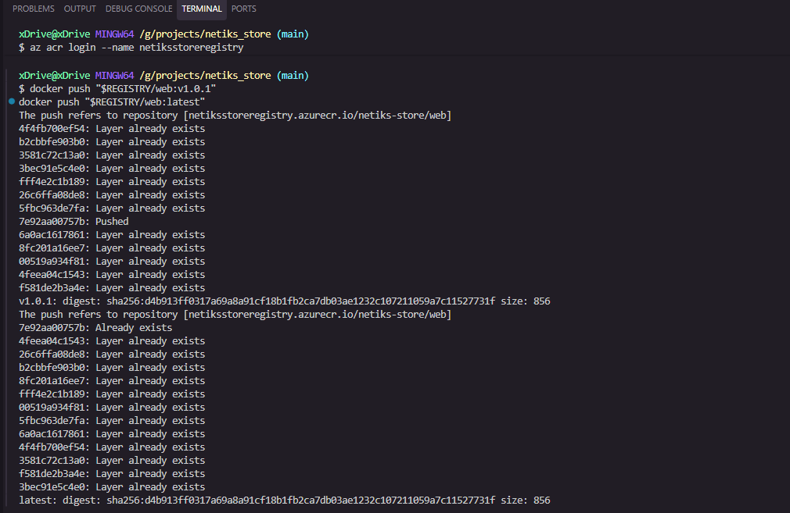
---

### Step 6.4: Update docker-compose.prod.yml

```bash
sed -i "s/web:v1.0.0/web:v1.0.1/" docker-compose.prod.yml

git add docker-compose.prod.yml
git commit -m "bump: update web service to v1.0.1"
git push origin main
```
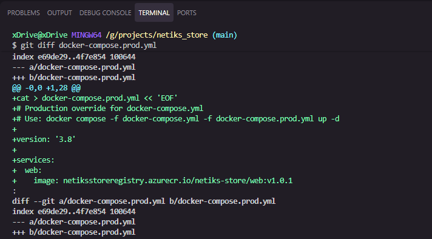

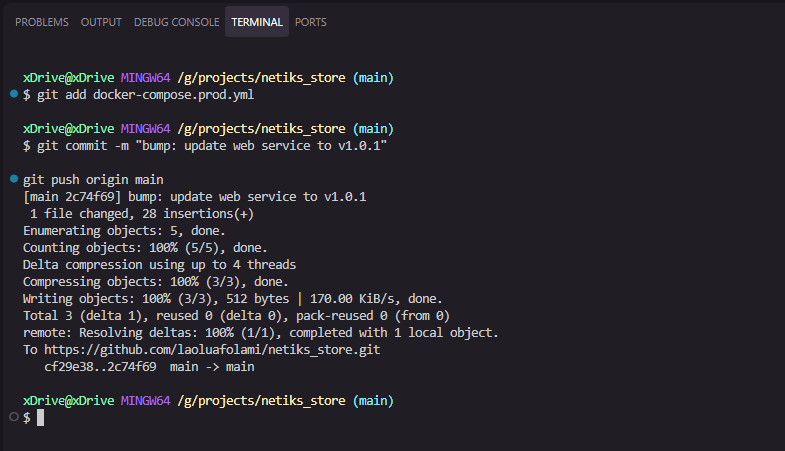
---

### Step 6.5: Deploy v1.0.1 on VM

**SSH into VM:**
```bash
ssh -i netiks-store-key.pem azureuser@YOUR_VM_IP

cd ~/netiks_store
git pull

docker compose -f docker-compose.yml -f docker-compose.prod.yml pull web
docker compose -f docker-compose.yml -f docker-compose.prod.yml up -d web

# Verify
docker ps --format "table {{.Names}}\t{{.Image}}" | grep web
# Expected: web:v1.0.1
```
 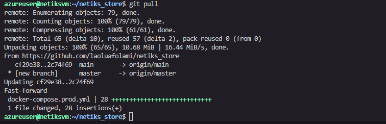

 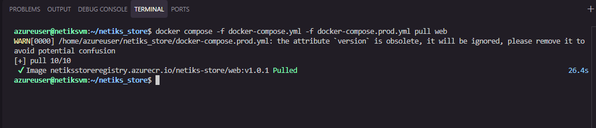

 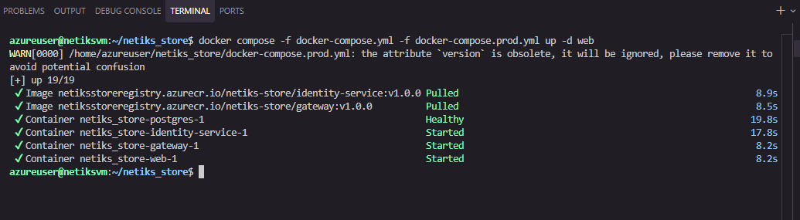

 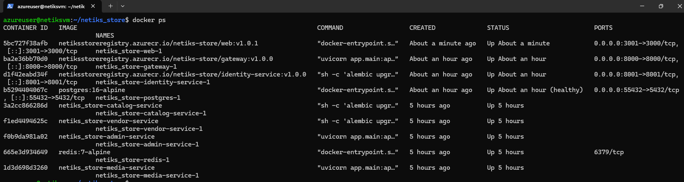
---
### **Step 6.8: Verify v1.0.1 Running**

```bash
docker ps --format "table {{.Names}}\t{{.Image}}" | grep web
```

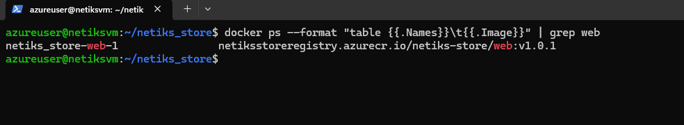


---

### **Step 6.9: Confirm App Works**

Open browser: `http://20.29.81.166/market`

Market page should load and work correctly.

---


### Step 6.6: Rollback to v1.0.0

```bash
# On local machine:
git revert HEAD --no-edit
git push origin main

# On VM:
cd ~/netiks_store
git pull
docker compose -f docker-compose.yml -f docker-compose.prod.yml pull web
docker compose -f docker-compose.yml -f docker-compose.prod.yml up -d web

# Verify rollback
docker ps --format "table {{.Names}}\t{{.Image}}" | grep web
# Expected: web:v1.0.0
```
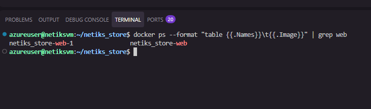
---

## Verification Tests

### Test 1: Verify Registry Access

```bash
az acr repository list --name netiksstoreregistry --output table
```
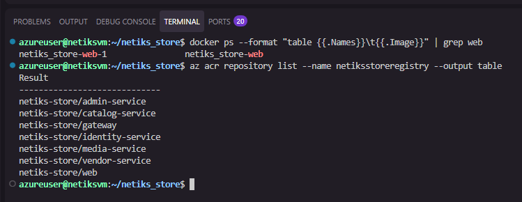

### **Answer 1: Why does only the changed service restart, and why does that matter for active sessions?**

**Why only web restarts:**

When you run:
```bash
docker compose up -d web  # Only web specified
```

Docker checks ONLY web service:
- Web: changed from v1.0.0 to v1.0.1 → STOP, PULL, START (10 seconds)
- Gateway: unchanged → KEEP RUNNING (never stops)
- Postgres: unchanged → KEEP RUNNING (never stops)
- Redis: unchanged → KEEP RUNNING (never stops)

**Why it matters for active sessions:**

**Scenario: 100 users checking out, paying now**

❌ **If ALL services restarted:**
```
Downtime: 60 seconds
Gateway STOPS → users disconnected
Redis STOPS → sessions lost
Postgres STOPS → transactions incomplete
Result: Users see "Connection Lost", checkout fails, lost sales
```

✅ **If ONLY web restarts (selective):**
```
Downtime: 10 seconds
Web STOPS → refreshes
Gateway RUNNING → still connected
Redis RUNNING → sessions safe
Postgres RUNNING → transactions continue
Result: Seamless experience, checkout completes, no lost sales
```

**Real Impact:**
- Active sessions preserved (Redis never stopped)
- Database transactions complete (Postgres never stopped)
- Users stay connected (Gateway never stopped)
- Only web briefly restarts
- Minimal disruption, zero data loss

---
### **Answer 2: Exact rollback command sequence if v1.0.1 turns out to be broken**

**COMPLETE ROLLBACK SEQUENCE:**

**STEP 1: On LOCAL PC - Revert**

```powershell
cd G:\projects\netiks_store

git revert HEAD --no-edit

git push origin main
```

---

**STEP 2: On VM - Pull and Deploy Old Version**

```bash
cd ~/netiks_store

git pull

docker compose -f docker-compose.yml -f docker-compose.prod.yml pull web

docker compose -f docker-compose.yml -f docker-compose.prod.yml up -d web
```

---

**STEP 3: Verify Rollback**

```bash
docker ps --format "table {{.Names}}\t{{.Image}}" | grep web

# Should show: web:v1.0.0

# Verify others never stopped:
docker compose ps
# All should be UP
```

---

**ONE-LINER EMERGENCY ROLLBACK (on VM):**

```bash
cd ~/netiks_store && git pull && docker compose -f docker-compose.yml -f docker-compose.prod.yml pull web && docker compose -f docker-compose.yml -f docker-compose.prod.yml up -d web && docker ps --format "table {{.Names}}\t{{.Image}}" | grep web
```

---

**Timeline:**
```
T+0 min: Detected v1.0.1 broken
T+1 min: Reverted locally, pushed
T+2 min: Pulled on VM
T+3 min: Pulled old image
T+4 min: Restarted
T+5 min: FIXED! v1.0.0 running

TOTAL: 5 minutes from broken to fixed!
```

---

### Key Achievements

✅ Created Azure Container Registry with 7 repositories  
✅ Built all services for linux/amd64 architecture  
✅ Pushed versioned images (v1.0.0, latest)  
✅ Created production compose file with immutable tags  
✅ Authenticated VM with service principal  
✅ Deployed without building on VM  
✅ Tested version bumps and instant rollbacks  

---

